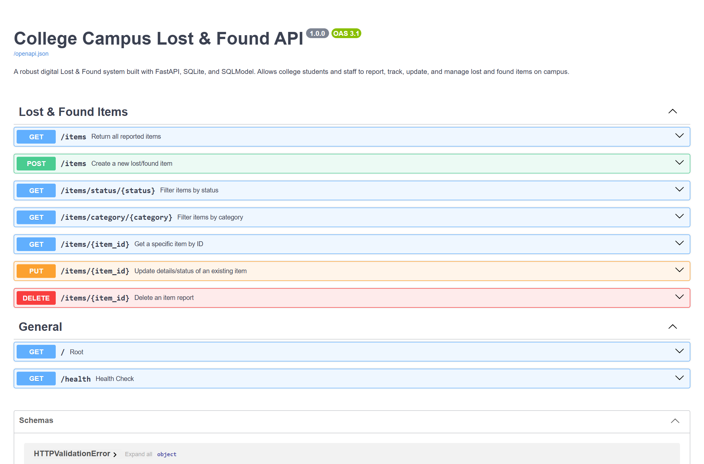
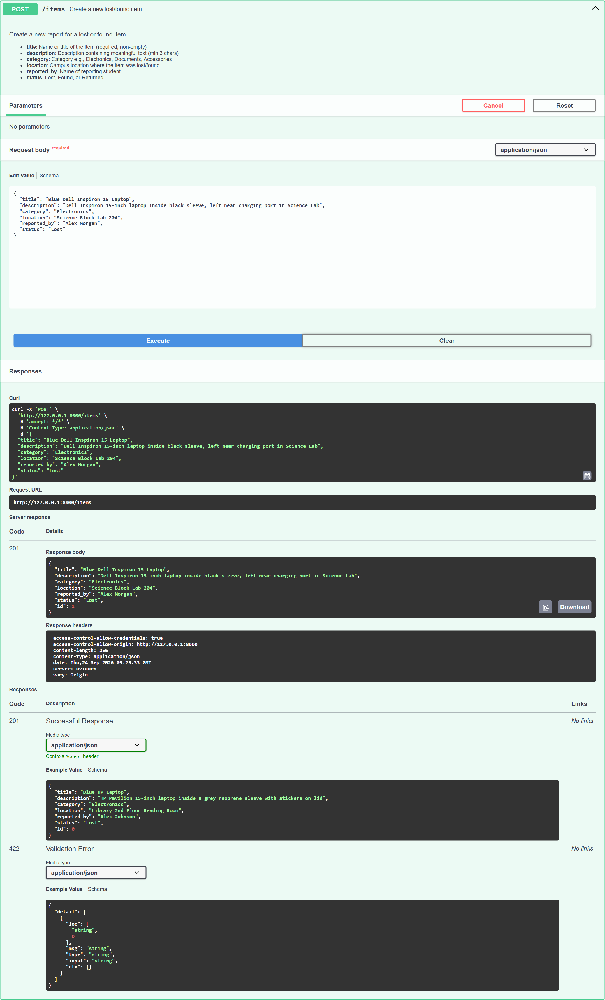
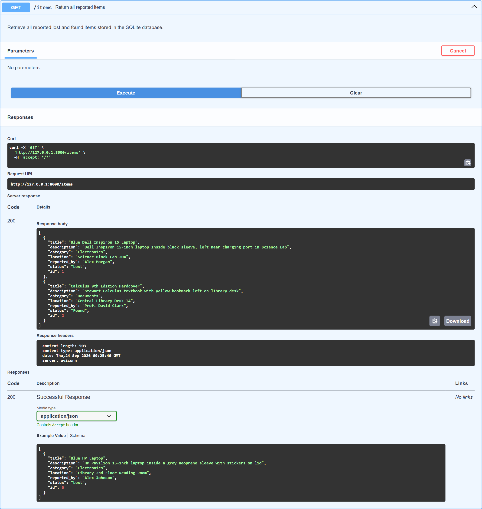
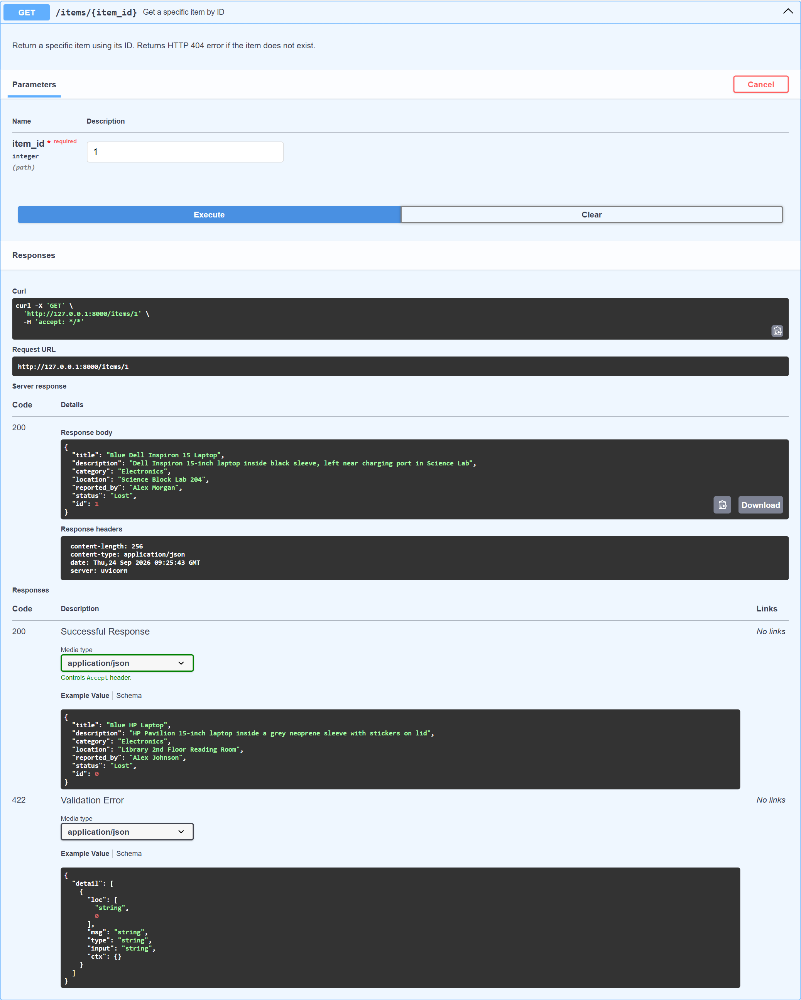
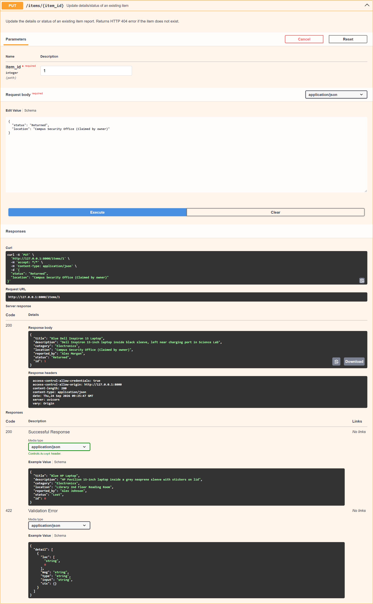
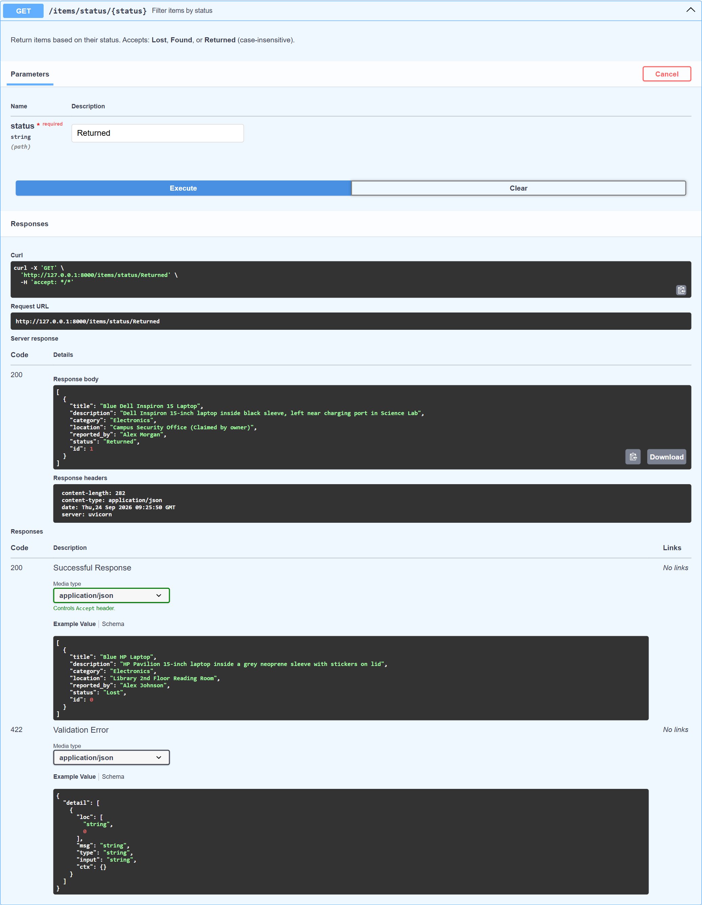
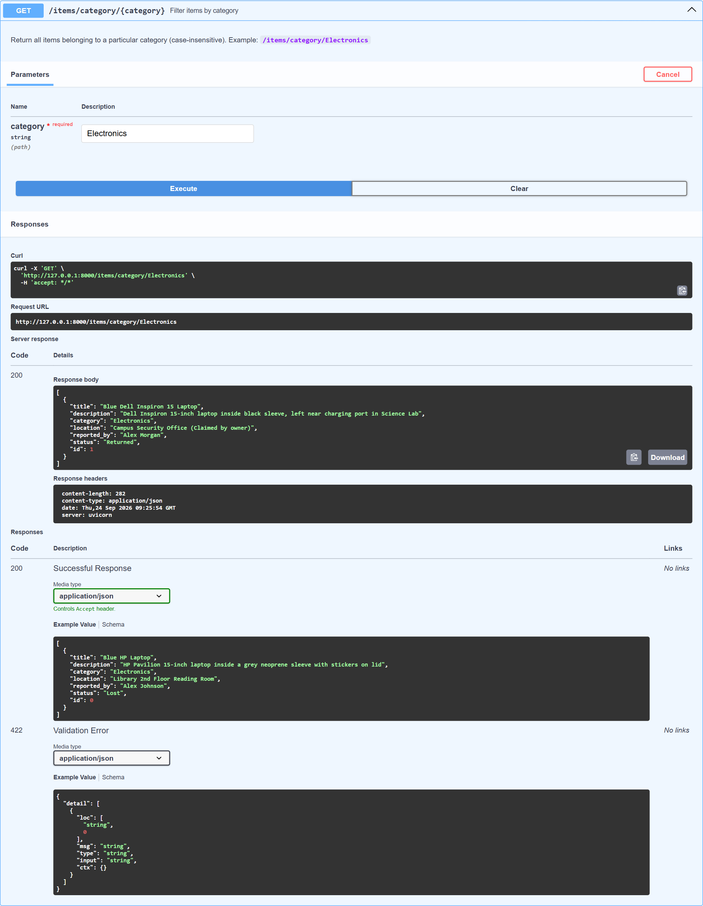
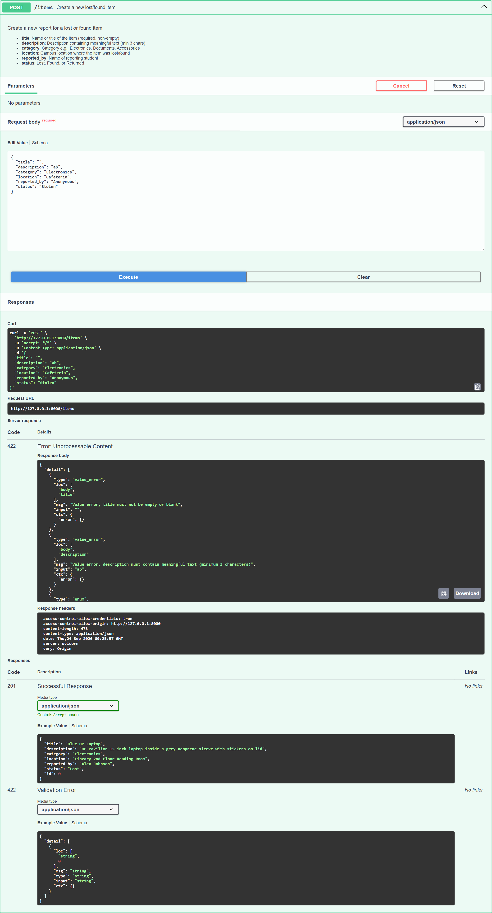
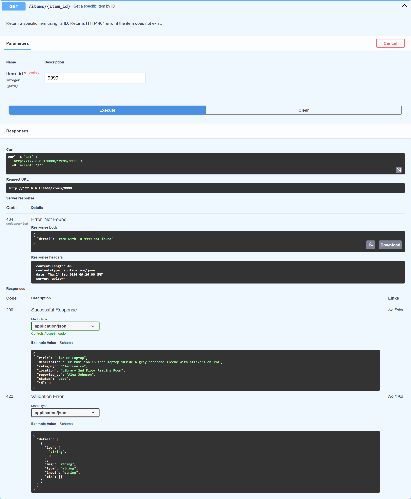
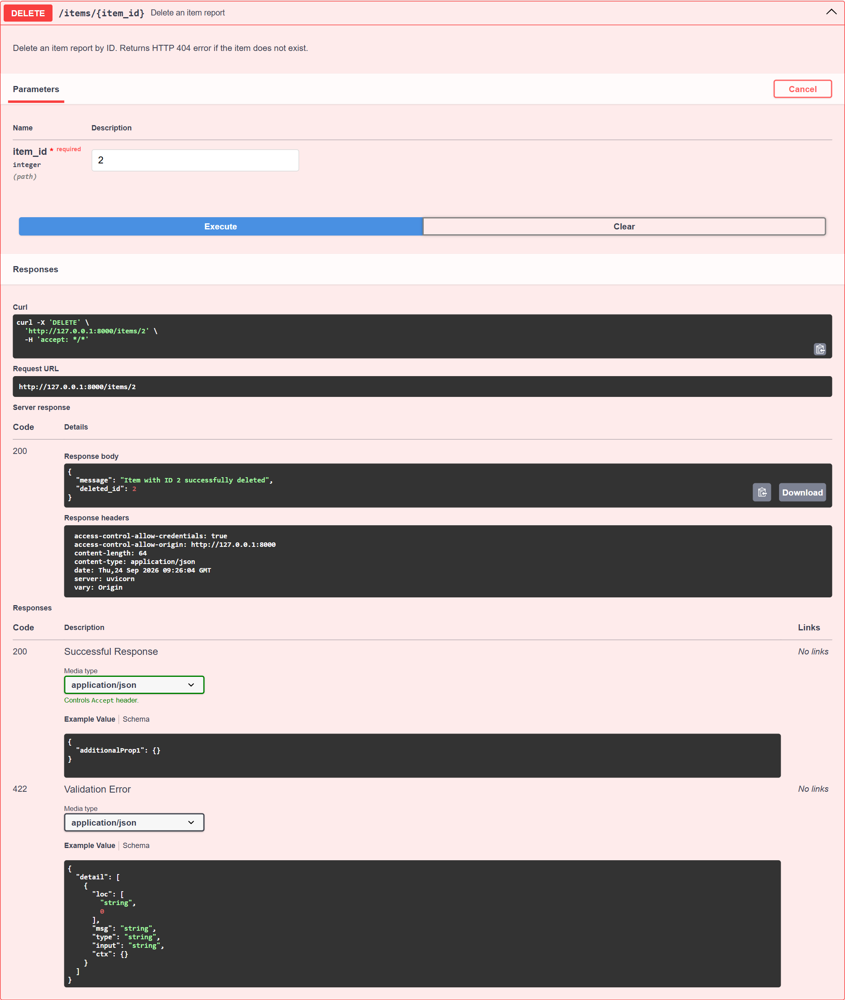

# 🏫 College Campus Lost & Found REST API

A modern, production-grade RESTful API built with **FastAPI**, **SQLite**, and **SQLModel** that allows college students and campus security to report, track, update, and manage lost and found items across the campus.

---

## 🌟 Key Highlights & Requirements Fulfilled

- **Framework**: FastAPI with automatic Swagger UI (`/docs`) and ReDoc (`/redoc`) documentation.
- **Database**: SQLite with connection thread handling (`check_same_thread=False`).
- **ORM & Data Layer**: SQLModel combining SQLAlchemy ORM with Pydantic data validation.
- **Database Engine**: Created cleanly using `create_engine()` with automatic schema migration on startup via FastAPI `lifespan`.
- **Validation**: Strict validation rules for title, description length, and restricted status values (`Lost`, `Found`, `Returned`).
- **Error Handling**: Graceful handling of missing records (`404 Not Found`), input violations (`422 Unprocessable Content`), and invalid filters (`400 Bad Request`).
- **Automated Testing**: 15 unit and integration tests passing with `pytest`.
- **Proof of Work**: Visual proof of execution for every required endpoint and error scenario captured in Swagger UI.

---

## 📁 Project Structure

```text
task1/
├── app/
│   ├── __init__.py         # Package initialization
│   ├── database.py         # SQLite engine creation, session dependency & init_db
│   ├── models.py           # SQLModel models & Pydantic validation schemas
│   ├── routes.py           # REST endpoints with route handlers
│   └── main.py             # FastAPI app, lifespan setup, CORS & root routes
├── screenshots/            # API execution proof screenshots
│   ├── 00_swagger_ui_overview.png
│   ├── 01_post_create_item.png
│   ├── 02_post_second_item.png
│   ├── 03_get_all_items.png
│   ├── 04_get_item_by_id.png
│   ├── 05_put_update_item.png
│   ├── 06_filter_by_status.png
│   ├── 07_filter_by_category.png
│   ├── 08_validation_error_422.png
│   ├── 09_error_item_not_found_404.png
│   └── 10_delete_item.png
├── scripts/
│   └── capture_evidence.py # Playwright automated Swagger testing & screenshot generator
├── tests/
│   ├── __init__.py
│   └── test_api.py         # Comprehensive pytest test suite (15 test cases)
├── .gitignore              # Ignores .env, virtual environments, .db, and cache files
├── requirements.txt        # Python package dependencies
└── README.md               # Complete setup, API documentation, and test guide
```

---

## 🗄️ Database Schema & Data Models

### `Item` Model Fields

| Field Name | Type | Key / Constraint | Description |
| :--- | :--- | :--- | :--- |
| `id` | `Integer` | Primary Key, Auto-increment | Unique identifier for each item report |
| `title` | `String` | Required, non-empty | Name or title of the item (e.g., "Blue HP Laptop") |
| `description` | `String` | Required, min 3 chars | Detailed description of the item |
| `category` | `String` | Required, non-empty | Category (e.g., `Electronics`, `Documents`, `Accessories`, `Clothing`) |
| `location` | `String` | Required, non-empty | Location where the item was lost/found on campus |
| `reported_by` | `String` | Required, non-empty | Name of the student or staff member reporting |
| `status` | `Enum` | `Lost`, `Found`, `Returned` | Restricted item status |

---

## 🚀 Installation & Setup Guide

### 1. Prerequisites
- Python 3.10+ installed ([python.org](https://www.python.org/))
- Git installed ([git-scm.com](https://git-scm.com/))

### 2. Clone the Repository
```bash
git clone https://github.com/<your-username>/lost-and-found-fastapi.git
cd lost-and-found-fastapi
```

### 3. Create and Activate a Virtual Environment
**On Windows (PowerShell):**
```powershell
python -m venv venv
.\venv\Scripts\Activate.ps1
```

**On macOS / Linux:**
```bash
python3 -m venv venv
source venv/bin/activate
```

### 4. Install Dependencies
```bash
pip install -r requirements.txt
```

### 5. Run the FastAPI Application
```bash
uvicorn app.main:app --reload --host 127.0.0.1 --port 8000
```

The server will initialize SQLite database tables automatically on startup.
- **Interactive Swagger UI**: [http://127.0.0.1:8000/docs](http://127.0.0.1:8000/docs)
- **ReDoc Interactive Documentation**: [http://127.0.0.1:8000/redoc](http://127.0.0.1:8000/redoc)
- **API Root / Status**: [http://127.0.0.1:8000/](http://127.0.0.1:8000/)

---

## 📡 API Endpoints Reference

| Method | Endpoint | Description | Status Code |
| :--- | :--- | :--- | :--- |
| `POST` | `/items` | Create a new lost/found item | `201 Created` |
| `GET` | `/items` | Retrieve all reported items | `200 OK` |
| `GET` | `/items/{item_id}` | Retrieve specific item by ID (404 if not found) | `200 OK` / `404` |
| `PUT` | `/items/{item_id}` | Update details or status of an existing item | `200 OK` / `404` |
| `DELETE` | `/items/{item_id}` | Delete an item report by ID | `200 OK` / `404` |
| `GET` | `/items/status/{status}` | Filter items by status (`Lost`, `Found`, `Returned`) | `200 OK` / `400` |
| `GET` | `/items/category/{category}` | Filter items by category (case-insensitive) | `200 OK` / `400` |
| `GET` | `/health` | Service health status | `200 OK` |

---

## 🧪 Running Automated Tests

Run the test suite using `pytest`:
```bash
pytest -v
```

All 15 tests run against an isolated in-memory SQLite database:
```text
tests/test_api.py::test_create_item_success PASSED
tests/test_api.py::test_create_item_validation_empty_title PASSED
tests/test_api.py::test_create_item_validation_short_description PASSED
tests/test_api.py::test_create_item_validation_invalid_status PASSED
tests/test_api.py::test_create_item_validation_missing_field PASSED
tests/test_api.py::test_get_all_items PASSED
tests/test_api.py::test_get_item_by_id_success PASSED
tests/test_api.py::test_get_item_by_id_not_found PASSED
tests/test_api.py::test_update_item_success PASSED
tests/test_api.py::test_update_item_not_found PASSED
tests/test_api.py::test_update_item_invalid_data PASSED
tests/test_api.py::test_delete_item_success PASSED
tests/test_api.py::test_delete_item_not_found PASSED
tests/test_api.py::test_filter_by_status PASSED
tests/test_api.py::test_filter_by_category PASSED

======================== 15 passed in 1.42s ========================
```

---

## 📸 Proof of Work: Swagger UI API Execution Screenshots

### 1. Swagger UI Overview


---

### 2. POST /items (Create Item)
*Creates a new lost item with status `Lost` and returns `201 Created` with generated `id: 1`.*


---

### 3. GET /items (List All Items)
*Returns all reported items stored in the SQLite database.*


---

### 4. GET /items/{item_id} (Retrieve Specific Item)
*Returns the details of item with ID `1`.*


---

### 5. PUT /items/{item_id} (Update Item Details / Status)
*Updates item #1 status to `Returned` and modifies the location.*


---

### 6. GET /items/status/{status} (Status Filtering)
*Filters all items matching status `Returned`.*


---

### 7. GET /items/category/{category} (Category Filtering)
*Filters all items belonging to category `Electronics`.*


---

### 8. Invalid Request Validation Error (`422 Unprocessable Content`)
*Demonstrates input validation: empty title, description under 3 characters, and invalid status `Stolen`.*


---

### 9. Error Handling: Item Not Found (`404 Not Found`)
*Requests non-existent item ID `9999` and returns HTTP 404 with error detail.*


---

### 10. DELETE /items/{item_id} (Delete Item Report)
*Deletes item report #2 from the database.*


---

## 🛡️ Security & Git Hygiene
- Sensitive `.env` files, SQLite binary databases (`*.db`), virtual environments (`venv/`), and compiled bytecode (`__pycache__/`) are excluded via `.gitignore`.
